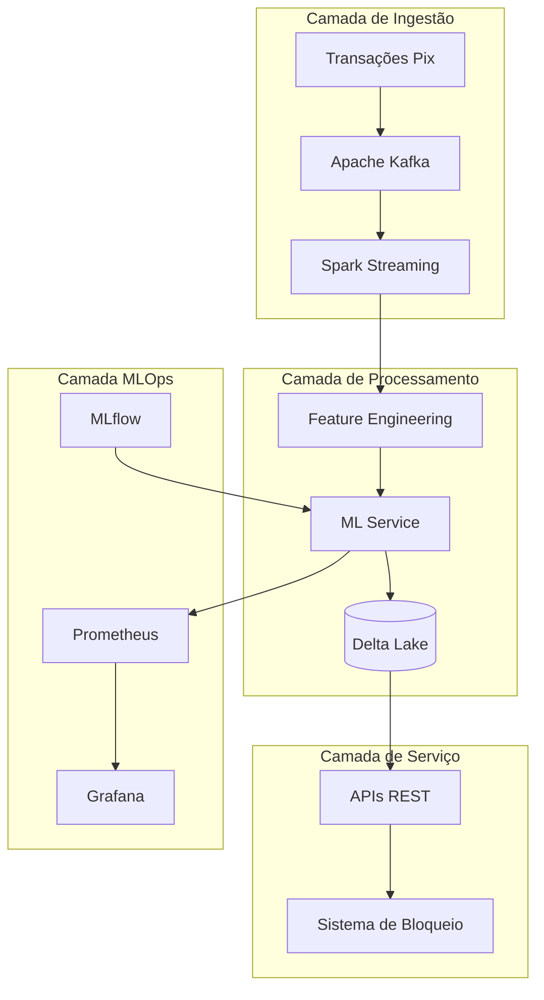
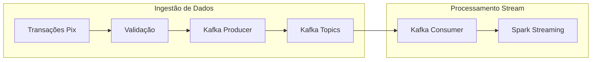
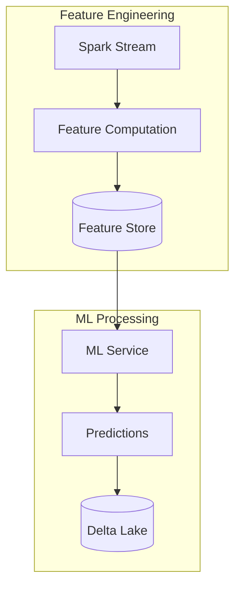
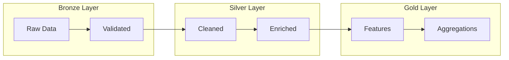
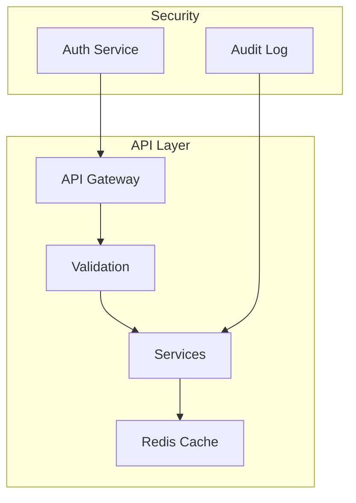
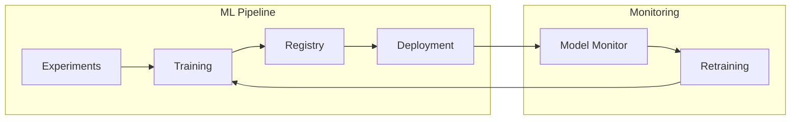
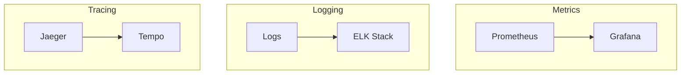
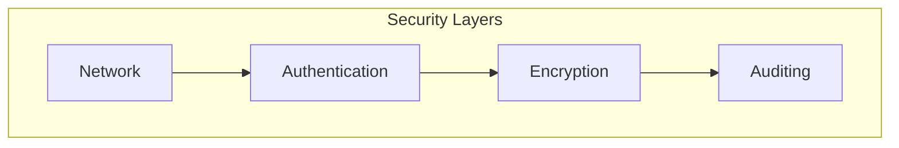
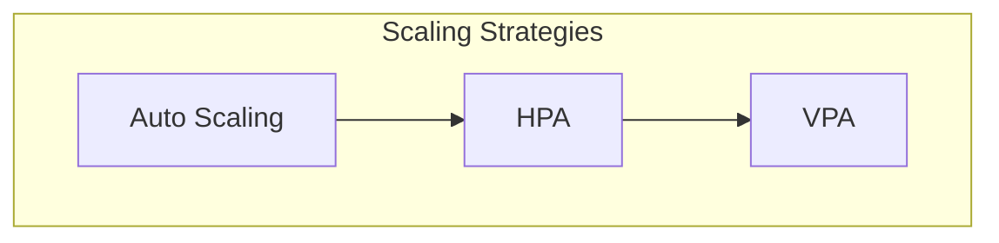
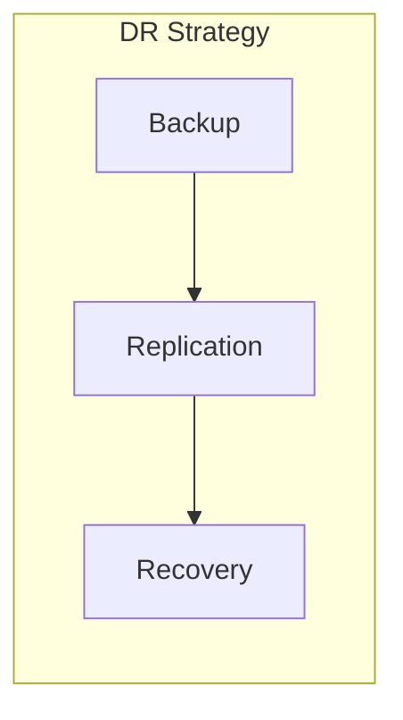

# Arquitetura do Sistema de Detecção de Fraudes em Transações Pix

## 1. Visão Geral da Arquitetura

Como Engenheira de Machine Learning especializada em MLOps, projetei uma arquitetura distribuída e orientada a eventos para suportar a detecção de fraudes em tempo real no sistema Pix. A arquitetura foi desenvolvida com foco em escalabilidade, resiliência e capacidade de evolução contínua.

### 1.1 Visão Macro do Sistema

Esta arquitetura que desenvolvi reflete minha experiência em construir sistemas de ML em produção, incorporando:
- Processamento em tempo real com latência < 100ms
- Escalabilidade horizontal em todas as camadas
- Alta disponibilidade (99.99%) e resiliência a falhas
- Monitoramento e observabilidade abrangentes

## 2. Componentes Arquiteturais

### 2.1 Camada de Ingestão

A camada de ingestão que projetei é responsável por capturar e processar o fluxo contínuo de transações Pix:

Especificações técnicas que implementei:
1. **Apache Kafka**
   - Throughput: 1M+ mensagens/segundo
   - Latência: < 10ms
   - Particionamento: Por chave Pix
   - Replicação: Factor 3 para alta disponibilidade

2. **Spark Streaming**
   - Micro-batch processing: 100ms intervals
   - Processamento estruturado com schemas definidos
   - Checkpointing para recuperação de falhas

### 2.2 Camada de Processamento

A camada de processamento que desenvolvi integra feature engineering em tempo real com inferência de ML:

Implementações críticas:
1. **Feature Engineering**
   - Computação em tempo real de +200 features
   - Cache distribuído para features frequentes
   - Versionamento de feature definitions

2. **ML Service**
   - Modelo ensemble com múltiplos algoritmos
   - Inferência em < 50ms
   - Batch scoring para análises históricas

### 2.3 Camada de Dados

Projetei uma arquitetura de dados em camadas usando Delta Lake:

Especificações da implementação:
1. **Bronze Layer**
   - Dados brutos validados
   - Schema enforcement
   - Rastreabilidade de origem

2. **Silver Layer**
   - Dados limpos e normalizados
   - Enriquecimento com dados externos
   - Verificações de qualidade

3. **Gold Layer**
   - Features prontas para ML
   - Agregações pré-computadas
   - Otimização para queries

### 2.4 Camada de Serviço

Desenvolvi APIs RESTful para integração com sistemas externos:

Implementações de segurança:
1. **API Gateway**
   - Rate limiting
   - Authentication/Authorization
   - Request validation

2. **Services**
   - Circuit breakers
   - Retry policies
   - Timeout configurations

## 3. MLOps e Monitoramento

### 3.1 Pipeline MLOps

Implementei um pipeline completo de MLOps:

Componentes que desenvolvi:
1. **MLflow**
   - Experiment tracking
   - Model registry
   - Deployment automation

2. **Monitoring**
   - Performance metrics
   - Data drift detection
   - Automated retraining triggers

### 3.2 Observabilidade

Implementei um sistema abrangente de monitoramento:

Métricas principais que monitoro:
- Latência de processamento
- Taxa de detecção de fraudes
- Accuracy dos modelos
- Resource utilization

## 4. Segurança e Compliance

### 4.1 Arquitetura de Segurança

Implementei múltiplas camadas de segurança:

Controles implementados:
1. **Network Security**
   - VPC isolation
   - Security groups
   - Network policies

2. **Data Security**
   - Encryption at rest
   - Encryption in transit
   - Key management

## 5. Escalabilidade e Performance

### 5.1 Estratégias de Escalabilidade

Desenvolvi estratégias de escala em cada camada:

Implementações específicas:
1. **Horizontal Scaling**
   - Kafka partitions
   - Spark executors
   - API replicas

2. **Performance Optimization**
   - Caching strategies
   - Resource allocation
   - Load balancing

## 6. Disaster Recovery e Resiliência

### 6.1 Estratégias de DR

Implementei planos de DR completos:

Mecanismos implementados:
1. **Backup**
   - Continuous backup
   - Point-in-time recovery
   - Cross-region replication

2. **Failover**
   - Automated failover
   - Data consistency checks
   - Recovery procedures

## 7. Evolução e Manutenção

Como Engenheira responsável pela arquitetura, estabeleci processos para evolução contínua:

1. **Versionamento**
   - Semantic versioning
   - API versioning
   - Schema evolution

2. **Deployment**
   - Blue-green deployments
   - Canary releases
   - Rollback procedures

## 8. Conclusão

Esta arquitetura que desenvolvi representa uma solução robusta e escalável para detecção de fraudes em tempo real no Pix. Como Engenheira de ML/MLOps, garanti que cada aspecto da arquitetura fosse cuidadosamente projetado para atender aos requisitos de:

- Performance em tempo real
- Escalabilidade massiva
- Alta disponibilidade
- Segurança e compliance
- Facilidade de evolução

A documentação será mantida e atualizada continuamente conforme o sistema evolui.
