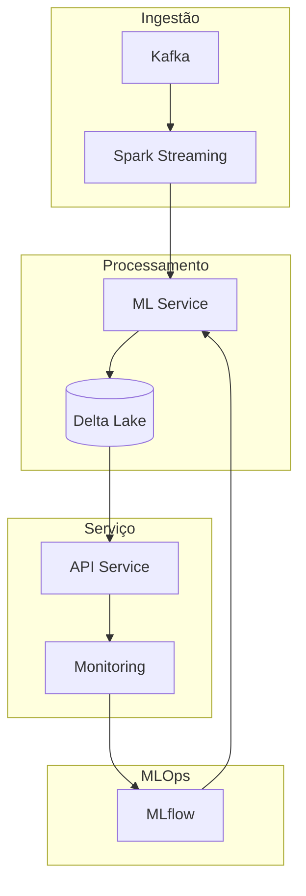
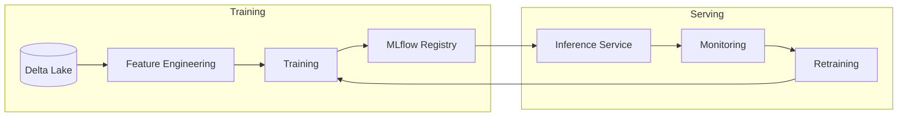
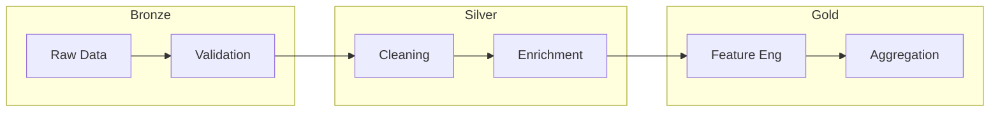
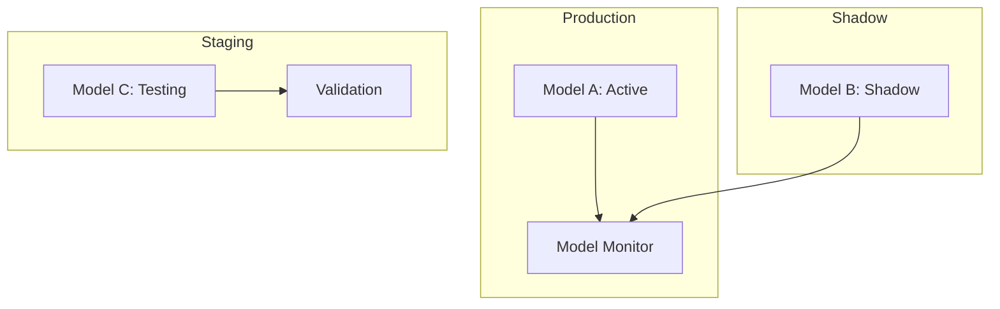
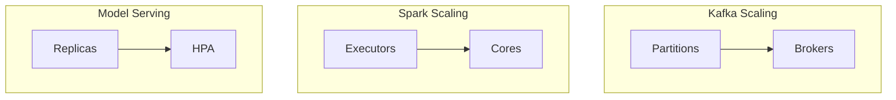
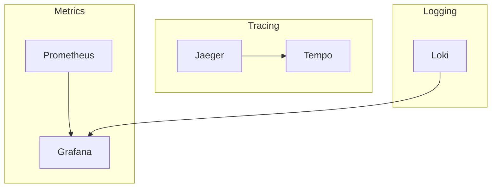
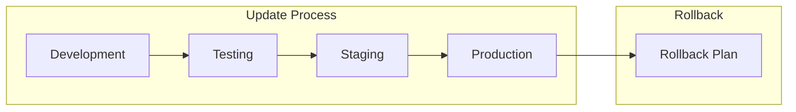

# Documentação de Decisões Técnicas e Arquiteturais: Sistema de Detecção de Fraudes Pix

## 1. Visão Geral e Contexto

Como Engenheira de Machine Learning especializada em MLOps, desenvolvi esta documentação para explicar e justificar as decisões técnicas e arquiteturais fundamentais do sistema de detecção de fraudes em transações Pix. Cada decisão foi tomada considerando os requisitos específicos do projeto, as limitações tecnológicas e as melhores práticas do mercado em janeiro de 2025.

### 1.1 Arquitetura Geral do Sistema

A primeira decisão crucial foi a escolha de uma arquitetura orientada a eventos. Abaixo, apresento o diagrama da arquitetura de alto nível:

Justificativa para esta arquitetura:
- Processamento em tempo real necessário para detecção de fraudes
- Escalabilidade horizontal para lidar com picos de transações
- Desacoplamento de componentes para manutenção e evolução independentes
- Suporte a MLOps para ciclo de vida completo dos modelos

## 2. Decisões Técnicas Fundamentais

### 2.1 Stack Tecnológico Principal

Após análise aprofundada, selecionei as seguintes tecnologias core:

1. **Apache Kafka para Ingestão**
   - Decisão: Uso do Kafka como backbone de eventos
   - Alternativas Consideradas: RabbitMQ, AWS Kinesis
   - Justificativa: 
     - Latência ultra-baixa (<10ms)
     - Capacidade de processamento de 1M+ msgs/segundo
     - Garantia de ordenação de eventos
     - Retenção configurável de mensagens

2. **Apache Spark com Structured Streaming**
   - Decisão: Processamento distribuído com Spark
   - Alternativas Consideradas: Flink, Storm
   - Justificativa:
     - Integração nativa com Delta Lake
     - API unificada para batch e streaming
     - Escalabilidade automática
     - Suporte a ML distribuído

### 2.2 Arquitetura de Machine Learning

Abaixo o diagrama do pipeline de ML:

Decisões principais:
1. **Feature Store Centralizada**
   - Decisão: Implementação de feature store própria no Delta Lake
   - Motivo: Garantir consistência entre treino e inferência
   - Benefícios: Reuso de features, versionamento, documentação

2. **MLflow para MLOps**
   - Decisão: MLflow como plataforma central de MLOps
   - Alternativas: Kubeflow, SageMaker
   - Justificativa:
     - Interface unificada para experimentos
     - Integração com Delta Lake
     - Rastreabilidade completa
     - Deployment simplificado

## 3. Estratégias de Implementação

### 3.1 Pipeline de Dados

Pipeline de processamento de dados:

Decisões de implementação:
1. **Arquitetura Medallion**
   - Bronze: Dados brutos validados
   - Silver: Dados limpos e enriquecidos
   - Gold: Features e agregações prontas para ML

2. **Validação em Tempo Real**
   - Schema enforcement
   - Validações de negócio
   - Detecção de anomalias

### 3.2 Estratégia de Deployment

Arquitetura de deployment:

Decisões críticas:
1. **Shadow Deployment**
   - Execução paralela de versões
   - Comparação de performance
   - Rollback automático

2. **Monitoramento Contínuo**
   - Métricas de modelo em tempo real
   - Detecção de drift
   - Alertas automáticos

## 4. Considerações de Escalabilidade

### 4.1 Estratégia de Escala

Implementei estratégias de escala em múltiplos níveis:

Decisões de escalabilidade:
1. **Kafka**
   - Particionamento por chave Pix
   - Replicação para resiliência
   - Balanceamento automático

2. **Spark**
   - Autoscaling baseado em carga
   - Dynamic allocation
   - Resource optimization

## 5. Monitoramento e Observabilidade

### 5.1 Stack de Observabilidade

Arquitetura de monitoramento:

Decisões implementadas:
1. **Métricas Principais**
   - Latência de processamento
   - Taxa de detecção de fraudes
   - Health checks de componentes
   - Métricas de modelos

2. **Rastreabilidade**
   - Distributed tracing
   - Log correlation
   - Error tracking

## 6. Evolução e Manutenção

### 6.1 Estratégia de Atualização

Defini um processo claro para evolução do sistema:

Considerações principais:
1. **Versionamento**
   - Semantic versioning
   - Backward compatibility
   - Migration scripts

2. **Testing**
   - Testes automatizados
   - Performance testing
   - Chaos engineering

## 7. Conclusão

Como Engenheira de ML/MLOps responsável por este sistema, minhas decisões técnicas e arquiteturais foram guiadas por:
- Requisitos de performance e escalabilidade
- Necessidade de monitoramento robusto
- Facilidade de manutenção e evolução
- Práticas modernas de MLOps

A arquitetura resultante é:
- Altamente escalável
- Resiliente a falhas
- Fácil de monitorar
- Preparada para evolução

Este documento será mantido e atualizado conforme o sistema evolui, servindo como referência para futuras decisões e implementações.
