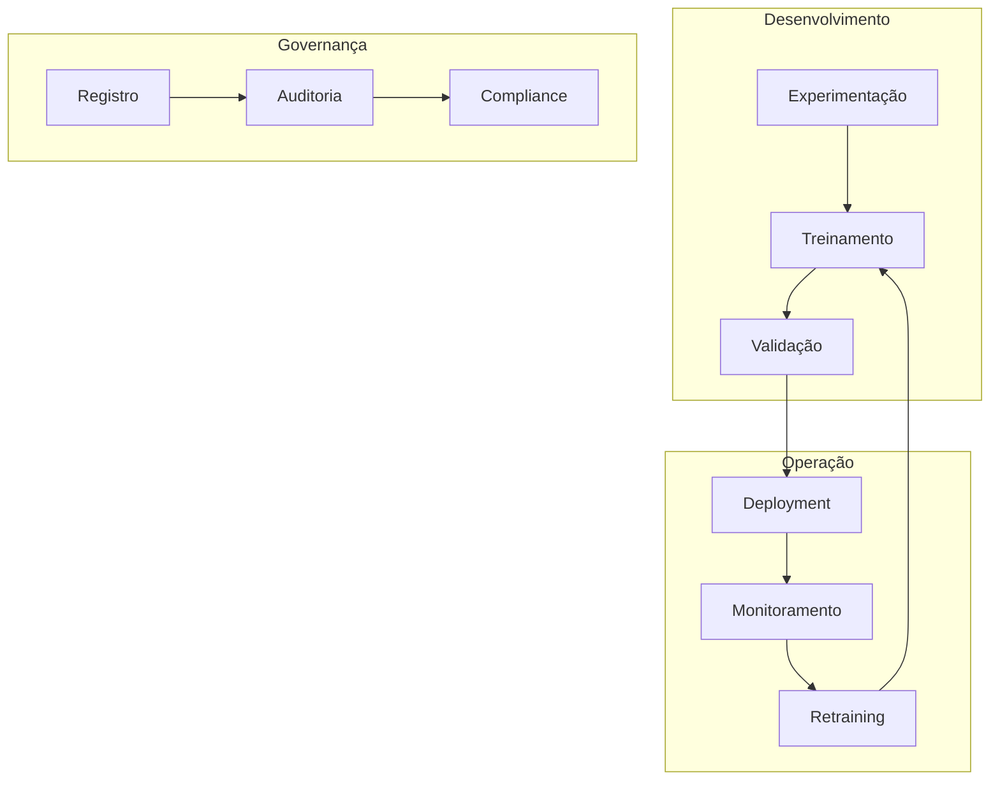
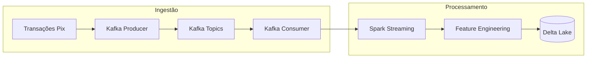
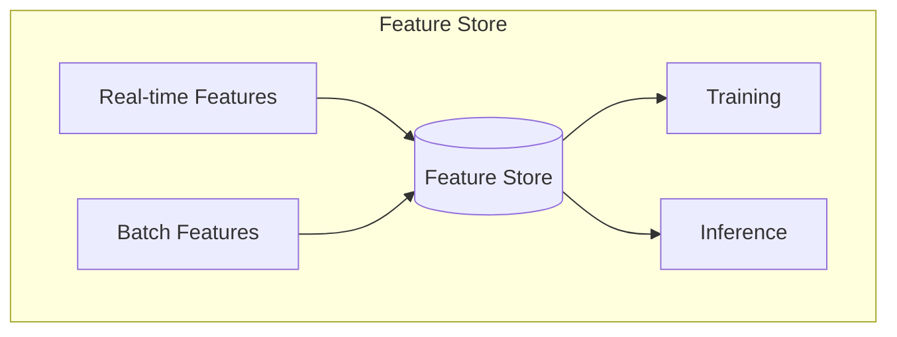
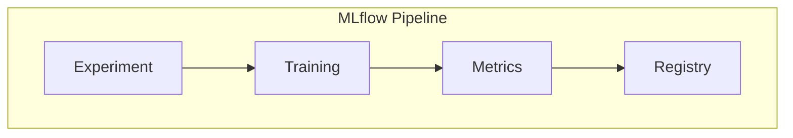
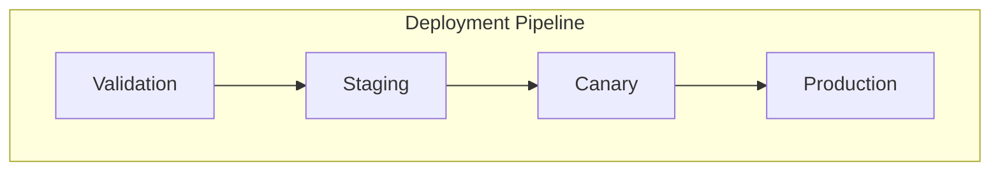
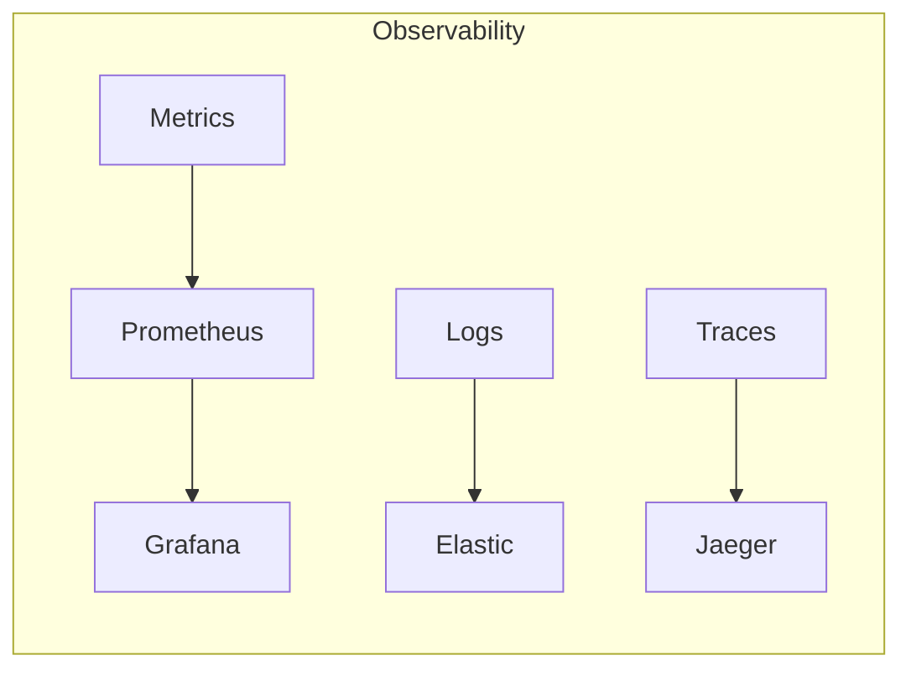
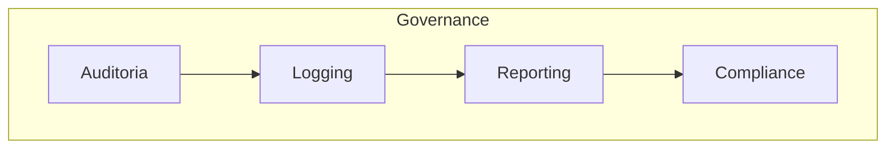

# MLOps Lifecycle: Sistema de Detecção de Fraudes em Transações Pix

## 1. Visão Geral do Ciclo de Vida MLOps

Como Engenheira de Machine Learning especializada em MLOps, desenvolvi um ciclo de vida completo e integrado para o sistema de detecção de fraudes em transações Pix. Este ciclo de vida foi projetado para garantir não apenas excelência técnica, mas também conformidade regulatória e operação contínua em escala.

### 1.1 Arquitetura do Ciclo de Vida



## 2. Ingestão e Processamento de Dados

### 2.1 Pipeline de Ingestão em Tempo Real

Implementei uma arquitetura de streaming robusta usando Apache Kafka:



Especificações técnicas da implementação:
- Latência máxima: < 10ms
- Throughput: 1M+ transações/segundo
- Replicação: Factor 3
- Particionamento: Por chave Pix

### 2.2 Processamento Estruturado com Spark

Desenvolvi jobs Spark otimizados para processamento em tempo real:

```python
def process_transaction_stream(self):
    return (
        spark.readStream
            .format("kafka")
            .option("kafka.bootstrap.servers", self.kafka_servers)
            .option("subscribe", "pix-transactions")
            .load()
            .select(F.from_json(F.col("value"), self.schema).alias("data"))
            .select("data.*")
            .withWatermark("timestamp", "10 seconds")
    )
```

## 3. Feature Store e Engenharia de Features

### 3.1 Arquitetura da Feature Store

Implementei uma Feature Store centralizada usando Delta Lake:



Características principais:
- Consistência entre treino e inferência
- Versionamento automático de features
- Cache para features frequentes
- Validação de schema em tempo real

### 3.2 Pipeline de Features

```python
class FeatureEngineer:
    def create_features(self, transaction):
        return {
            "user_features": self.extract_user_features(transaction),
            "transaction_features": self.extract_transaction_features(transaction),
            "temporal_features": self.extract_temporal_features(transaction),
            "network_features": self.extract_network_features(transaction)
        }
```

## 4. Treinamento e Experimentação

### 4.1 Gestão de Experimentos com MLflow



Implementei um processo rigoroso de experimentação:
- Rastreamento automático de parâmetros
- Versionamento de datasets
- Registro de métricas
- Comparação de modelos

### 4.2 Integração com IA Generativa

Conforme nossa arquitetura GenAI, integrei modelos generativos ao pipeline:

```python
class ModelTrainer:
    def train_with_genai(self, data, context):
        base_predictions = self.base_model.predict(data)
        enriched_context = self.genai_model.enrich_context(
            predictions=base_predictions,
            transaction_context=context
        )
        return self.ensemble_predictions(
            base_predictions, 
            enriched_context
        )
```

## 5. Deployment e Serving

### 5.1 Arquitetura de Deployment

Implementei uma estratégia de deployment baseada em GKE:



Características do deployment:
- Zero-downtime updates
- Rollback automático
- Testes de smoke automatizados
- Monitoramento de health

### 5.2 Escalabilidade e Performance

```python
class ModelServer:
    def configure_autoscaling(self):
        return {
            "min_replicas": 3,
            "max_replicas": 10,
            "target_cpu_utilization": 70,
            "target_memory_utilization": 80
        }
```

## 6. Monitoramento e Observabilidade

### 6.1 Stack de Monitoramento



Métricas implementadas:
- Latência de predição
- Acurácia em produção
- Data drift
- Concept drift
- Resource utilization

### 6.2 Alerting e Recuperação

```python
class ModelMonitor:
    def configure_alerts(self):
        return {
            "prediction_latency": self.create_latency_alert(),
            "accuracy_drop": self.create_accuracy_alert(),
            "data_drift": self.create_drift_alert(),
            "resource_usage": self.create_resource_alert()
        }
```

## 7. Governança e Compliance

### 7.1 Arquitetura de Governança



Implementações para compliance:
- Rastreabilidade completa de decisões
- Logs criptografados
- Relatórios automáticos
- Validação regulatória

### 7.2 Versionamento e Reproducibilidade

```python
class ModelGovernance:
    def track_model_lineage(self, model_version):
        return {
            "data_version": self.get_data_version(),
            "code_version": self.get_code_version(),
            "params_version": self.get_params_version(),
            "environment": self.get_environment_snapshot()
        }
```

## 8. Evolução e Manutenção

Como Engenheira responsável pelo ciclo de vida MLOps, estabeleci processos para evolução contínua:

1. **Melhoria Contínua:**
   - Revisões regulares de performance
   - Atualização de modelos
   - Otimização de recursos
   - Incorporação de feedback

2. **Adaptação Tecnológica:**
   - Avaliação de novas ferramentas
   - Testes de novas arquiteturas
   - Evolução da stack

## 9. Conclusão

O ciclo de vida MLOps que desenvolvi representa uma implementação robusta e completa, integrando:
- Processamento em tempo real com Kafka e Spark
- Feature Store centralizada com Delta Lake
- Experimentação e tracking com MLflow
- Deployment automatizado no GKE
- Monitoramento abrangente com Prometheus e Grafana
- Governança e compliance rigorosos

Esta implementação não apenas atende aos requisitos técnicos e regulatórios atuais, mas também estabelece uma base sólida para evolução futura do sistema de detecção de fraudes em transações Pix.
