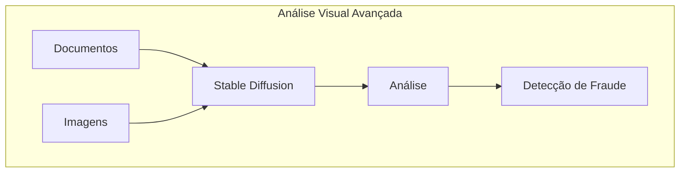
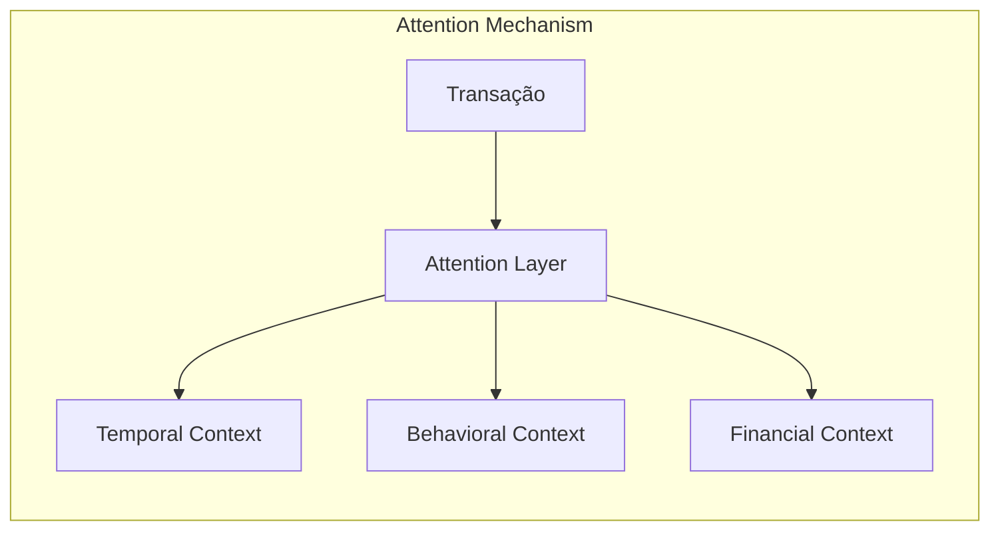
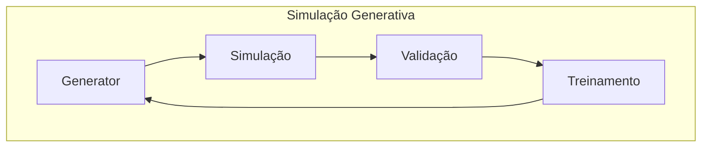
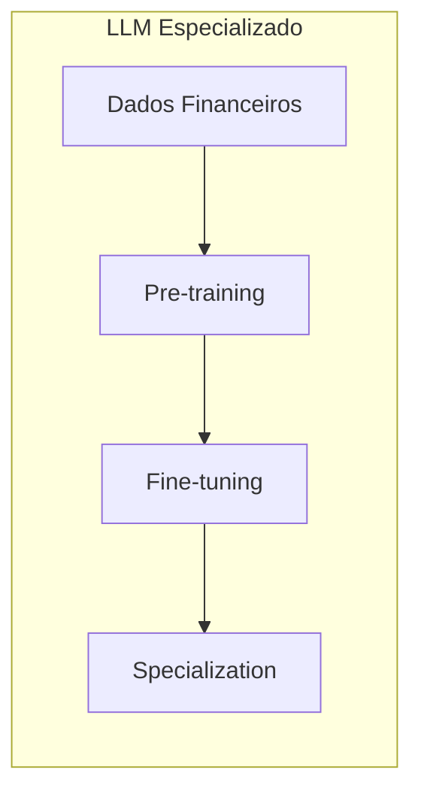
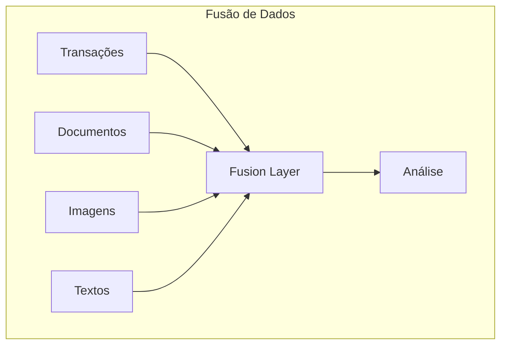
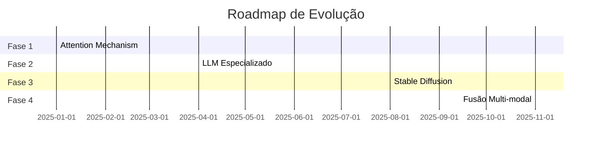

# Oportunidades de Evolução Futura: Sistema de Detecção de Fraudes Pix

## 1. Introdução e Contexto

Como Engenheira de Machine Learning especializada em MLOps, identifico diversas oportunidades estratégicas para evolução do sistema de detecção de fraudes Pix, considerando o cenário tecnológico de 2025. Esta análise visa apresentar caminhos de evolução que mantenham o sistema na vanguarda tecnológica, antecipando tendências e fortalecendo ainda mais sua eficácia.

## 2. Evolução da Camada de IA Generativa

### 2.1 Integração com Stable Diffusion para Análise Visual

A incorporação de análise visual avançada através de Stable Diffusion representa uma oportunidade significativa para fortalecer a detecção de fraudes:

**Benefícios Potenciais:**
- Verificação avançada de documentos de identidade
- Detecção de deepfakes em documentações
- Análise de assinaturas e padrões visuais suspeitos
- Validação de comprovantes de transações

### 2.2 Arquitetura de Atenção Especializada

Implementação de mecanismos de atenção específicos para transações financeiras:

**Aprimoramentos Propostos:**
- Atenção multi-head específica para séries temporais financeiras
- Mecanismos de auto-atenção para análise comportamental
- Cross-attention entre diferentes fontes de dados
- Interpretabilidade aprimorada das decisões do modelo

## 3. Arquiteturas Generativas Avançadas

### 3.1 Redes Generativas para Simulação

Desenvolvimento de uma camada de simulação para treinamento e teste:

**Aplicações Propostas:**
- Geração de cenários de fraude para treinamento
- Simulação de novos padrões de ataque
- Teste de robustez do sistema
- Validação de contramedidas

### 3.2 LLMs Especializados em Domínio Financeiro

Desenvolvimento de modelos de linguagem específicos para o domínio financeiro:

**Características Propostas:**
- Pré-treinamento com dados específicos do setor financeiro
- Fine-tuning para detecção de fraudes
- Compreensão profunda de terminologia financeira
- Análise contextual especializada

## 4. Integração Avançada de Dados

### 4.1 Fusão Multi-modal de Dados

**Oportunidades Identificadas:**
- Integração de dados estruturados e não estruturados
- Análise multi-modal de padrões de fraude
- Correlação entre diferentes fontes de dados
- Detecção de anomalias multi-dimensionais

## 5. Considerações de Implementação

### 5.1 Requisitos de Infraestrutura

Para suportar estas evoluções, seria necessário:

1. **Computação:**
   - GPUs especializadas para modelos generativos
   - Infraestrutura de processamento distribuído
   - Sistemas de cache otimizados

2. **Armazenamento:**
   - Sistemas de armazenamento de alta performance
   - Estruturas otimizadas para dados multi-modais
   - Cache distribuído para inferência

### 5.2 Considerações de Custo-Benefício

Análise preliminar de ROI para cada evolução proposta:

1. **Stable Diffusion Integration:**
   - Custo inicial: Alto (infraestrutura + treinamento)
   - ROI esperado: Médio prazo (6-12 meses)
   - Benefícios principais: Redução de fraudes documentais

2. **Attention Mechanism Especializado:**
   - Custo inicial: Médio
   - ROI esperado: Curto prazo (3-6 meses)
   - Benefícios principais: Melhoria na acurácia

## 6. Roadmap de Evolução

Proposta de implementação faseada:

## 7. Conclusão

As oportunidades de evolução identificadas posicionariam o sistema na vanguarda da detecção de fraudes em 2025, incorporando as mais recentes inovações em IA Generativa e processamento de dados. A implementação faseada permite uma evolução controlada e sustentável, mantendo a robustez do sistema atual enquanto agrega novas capacidades.

Como Engenheira de ML/MLOps, minha análise indica que estas evoluções não apenas fortaleceriam a capacidade de detecção de fraudes, mas também estabeleceriam uma base sólida para futuras inovações, mantendo o sistema relevante e eficaz diante da evolução constante das ameaças de fraude.
